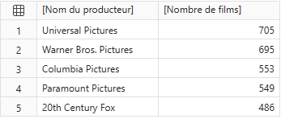

# Pratique du langage DAX 

Ce document rassemble une série de requêtes DAX réalisées dans Power BI, à travers l’éditeur de requêtes DAX (vue de requête). Le but était de m’entraîner à manipuler le langage DAX, même lorsque certaines requêtes pouvaient être réalisées plus simplement via des visuels ou des segments. Les requêtes sont triées par difficulté croissante.

Pour rappel, les tables de données et les relations entres elles sont comme ci-dessous : 


--- 

## 1 - Titres des films sortis après 2015

```dax
EVALUATE
	VAR dates =
	SELECTCOLUMNS(
		FILTER(
			films,
			YEAR(films[date_sortie]) > 2015
		),
		"Titre", films[titre]
	)
	RETURN
		dates
```

---

## 2 - Genres associés aux films

```dax
EVALUATE
	VAR firstJoin =
	NATURALINNERJOIN(
		films_genres,
		genres
	)
	RETURN
		SELECTCOLUMNS(
			NATURALINNERJOIN(
				firstJoin,
				films
			),
			"Titre", films[titre],
			"Genre", genres[genre]
		)
```

---

## 3 - 10 premiers films par ordre alphabétique

```dax
EVALUATE
	VAR tt =
	FILTER(
		films,
		LEFT(films[titre], 1) IN {"a","b","c","d","e","f","g","h","i","j","k","l","m","n","o","p","q","r","s","t","u","v","w","x","y","z"}
	)
	RETURN
		TOPN(
			10,
			tt,
			films[titre],
			ASC
		)
```

---


## 4 - Nombre de genres par film (uniquement ceux > 3)

```dax
EVALUATE
	VAR groupe =
	GROUPBY(
		films_genres,
		films_genres[film_id],
		"Genre",
		COUNTX(
			CURRENTGROUP(),
			films_genres[genre_id]
		)
	)
	RETURN
		SELECTCOLUMNS(
			ADDCOLUMNS(
				FILTER(
					groupe,
					[Genre] > 3
				),
				"Titre", LOOKUPVALUE(
					films[titre],
					films[id],
					films_genres[film_id]
				)
			),
			"Titre", [Titre],
			"Nombre de genre", [Genre]
		)
ORDER BY [Nombre de genre] DESC
```

Résultat : 


---


## 5 - Films US produits par des producteurs français

```dax
EVALUATE
	DISTINCT(SELECTCOLUMNS(
		FILTER(
			ADDCOLUMNS(
				films_producteurs,
				"Producteur", LOOKUPVALUE(producteurs[nom_entreprise], producteurs[id], films_producteurs[producteur_id]),
				"Titre", LOOKUPVALUE(films[titre], films[id], films_producteurs[film_id]),
				"Origine", LOOKUPVALUE(producteurs[pays_origine], producteurs[id], films_producteurs[producteur_id])
			),
			[Origine] = "FR" &&
			LOWER(LEFT([Titre], 1)) IN {"a","b","c","d","e","f","g","h","i","j","k","l","m","n","o","p","q","r","s","t","u","v","w","x","y","z"}
		),
		"Film produit en France", [Titre]
	))
```

Résultat : 


---


## 6 - Films avec plus de 4 genres

```dax
EVALUATE
	VAR groupe =
	GROUPBY(
		films_genres,
		films_genres[film_id],
		"Genre",
		COUNTX(CURRENTGROUP(), films_genres[genre_id])
	)
	RETURN
		SELECTCOLUMNS(
			ADDCOLUMNS(
				FILTER(groupe, [Genre] > 3),
				"Titre", LOOKUPVALUE(films[titre], films[id], films_genres[film_id])
			),
			"Titre", [Titre],
			"Nombre de genre", [Genre]
		)
```

---


## 7 - Nombre total de films par genre

```dax
EVALUATE
	SELECTCOLUMNS(
		ADDCOLUMNS(
			GROUPBY(
				films_genres,
				films_genres[genre_id],
				"Nombre",
				COUNTX(
					CURRENTGROUP(),
					1
				)
			),

			"GenreNom", LOOKUPVALUE(
				genres[genre],
				genres[id],
				films_genres[genre_id]
			)
		),

		"Genre", [GenreNom],
		"Nombre de film", [Nombre]
	)
```

Résultat :


---


## 8 - Acteurs les plus populaires (sexe = femme, popularité > 5)

```dax
EVALUATE
	SELECTCOLUMNS(
		FILTER(
			ADDCOLUMNS(
				acteurs,
				"Genre", IF(
					acteurs[sexe] = 1,
					"Femme",
					"Homme"
				),
				"Popularité", LOOKUPVALUE(
					films_acteurs[popularite],
					films_acteurs[acteur_id],
					acteurs[id]
				)
			),

			acteurs[sexe] = 1 &&
			LOOKUPVALUE(
				films_acteurs[popularite],
				films_acteurs[acteur_id],
				acteurs[id]
			) > 5
		),

		"Nom", acteurs[nom]
	)
```

> Popularité supérieure à 5 permet d'éviter le renvoie de milliers d'actrices

---


## 9 - Films notés > 7 avec les acteurs principaux les plus populaires

```dax
EVALUATE
	SELECTCOLUMNS(
		FILTER(
			ADDCOLUMNS(
				films_acteurs,
				"Nom", RELATED(acteurs[nom]),
				"Titrefilm", RELATED(films[titre]),
				"Note du film", RELATED(films[note_moyenne]),
				"Genre", RELATED(acteurs[sexe])
			),
			[Note du film] > 7 &&
			[Genre] = 2 &&
			LOWER(LEFT([Titrefilm], 1)) IN {"a","b","c","d","e","f","g","h","i","j","k","l","m","n","o","p","q","r","s","t","u","v","w","x","y","z"}
		),
		"Titre", [Titrefilm],
		"Acteur", [Nom],
		"Note", [Note du film],
		"Popularité", films_acteurs[popularite]
	)
ORDER BY [Popularité] DESC, [Note] DESC
```

Résultat :


---


## 10 - Top 5 des producteurs ayant produit le plus de films 

```dax
EVALUATE
	SELECTCOLUMNS(
		TOPN(
			5,
			ADDCOLUMNS(
				GROUPBY(
					films_producteurs,
					films_producteurs[producteur_id],
					"Nombre",
					COUNTX(
						CURRENTGROUP(),
						1
					)
				),

				"Nom", LOOKUPVALUE(
					producteurs[nom_entreprise],
					producteurs[id],
					films_producteurs[producteur_id]
				)
			),

			[Nombre],
			DESC
		),

		"Nom du producteur", [Nom],
		"Nombre de films", [Nombre]
	)
	ORDER BY [Nombre de films] DESC
```

Résultat :



---


## 11 - Pour chaque acteur, le nombre de films joués et la note moyenne globale de ses films joués

```dax
EVALUATE
	VAR nb_film_minim = 10
	RETURN
    SELECTCOLUMNS(
		FILTER(
			ADDCOLUMNS(
				GROUPBY(
					ADDCOLUMNS(
						films_acteurs, 
						"Note film", LOOKUPVALUE(films[note_moyenne], films[id], films_acteurs[film_id])), 

					films_acteurs[acteur_id], 

					"NB film", COUNTX(CURRENTGROUP(), 1), 
					"Note moy", AVERAGEX(CURRENTGROUP(), [Note film])), 

				"Nom acte", LOOKUPVALUE(acteurs[nom], acteurs[id], films_acteurs[acteur_id])), 

			[NB film] > nb_film_minim),

		"Nom de l'acteur", [Nom acte], 
		"Nombre de film", [NB film], 
		"Note moyenne des films", [Note moy])
ORDER BY [Note moyenne des films] DESC
```

---


## 12 - Note moyenne des films avec un revenu qui dépassent 10 fois le budget, puis 8 fois, 6 fois, ..., puis ne dépasse pas le budget

> Cela permet de voir s'il y'a une corrélation entre bénéfice et la note, sans visuel. 

```dax
EVALUATE
    VAR dix = 
        AVERAGEX(
            FILTER(
                films, 
                films[budget] > 0 && films[revenu] > 10 * films[budget]), 
            films[note_moyenne])
    VAR huit = 
        AVERAGEX(
            FILTER(
                films, 
                films[budget] > 0 && films[revenu] > 8 * films[budget] && films[revenu] < 10 * films[budget]), 
            films[note_moyenne])
    VAR six = 
        AVERAGEX(
            FILTER(
                films, 
                films[budget] > 0 && films[revenu] > 6 * films[budget] && films[revenu] < 8 * films[budget]), 
            films[note_moyenne])
    VAR quatre = 
        AVERAGEX(
            FILTER(
                films, 
                films[budget] > 0 && films[revenu] > 4 * films[budget] && films[revenu] < 6 * films[budget]), 
            films[note_moyenne])
    VAR deux = 
        AVERAGEX(
            FILTER(
                films, 
                films[budget] > 0 && films[revenu] > 2 * films[budget] && films[revenu] < 4 * films[budget]), 
            films[note_moyenne])
    VAR zero = 
        AVERAGEX(
            FILTER(
                films, 
                films[budget] > 0 && films[revenu] > 0 && films[revenu] < films[budget]), 
            films[note_moyenne])
    RETURN 
        UNION(
            ROW("Budget", "10x le budget", "Note moyenne", dix), 
            ROW("Budget", "8x le budget", "Note moyenne", huit), 
            ROW("Budget", "6x le budget", "Note moyenne", six), 
            ROW("Budget", "4x le budget", "Note moyenne", quatre),
            ROW("Budget", "2x le budget", "Note moyenne", deux), 
            ROW("Budget", "Déficit", "Note moyenne", zero)
        )
```

---


## 13 - Amélioration du code 12, 

> Ce code est mieux adapté, il évite d'avoir à répéter plusieurs fois les mêmes opérations comme au dessus. Il permet également d'ajouter des agrégations, chose que l'on ne pouvait pas faire au dessus sans le rajout de nombreuses variables supplémentaires.

```dax
EVALUATE
    VAR tranches =
    DATATABLE(
        "Budget", STRING, 
        "Max", INTEGER, 
        "Min", INTEGER, 

        {
            {"20x", 100000, 20}, 
            {"19x", 20, 19},
            {"18x", 19, 18}, 
            {"17x", 18, 17},
            {"16x", 17, 16}, 
            {"15x", 16, 15},
            {"14x", 15, 14}, 
            {"13x", 14, 13},
            {"12x", 13, 12},
            {"11x", 12, 11},
            {"10x", 11, 10}, 
            {"09x", 10, 9}, 
            {"08x", 9, 8}, 
            {"07x", 8, 7}, 
            {"06x", 7, 6}, 
            {"05x", 6, 5},
            {"04x", 5, 4}, 
            {"03x", 4, 3}, 
            {"02x", 3, 2}, 
            {"01x", 2, 1},
            {"Déficit", 1, 0}
        })
RETURN 
    SELECTCOLUMNS(
        ADDCOLUMNS(
            tranches, 
            "Note moyenne", 
            AVERAGEX(
                FILTER(
                    films, 
                    films[budget] > 0 && films[revenu] > 0 &&
                    DIVIDE(films[revenu], films[budget]) > [Min] &&
                    DIVIDE(films[revenu], films[budget]) < [Max]), 

                films[note_moyenne]), 

            "Nombre", 
            COUNTX(
                FILTER(
                    films, 
                    films[budget] > 0 && films[revenu] > 0 &&
                    DIVIDE(films[revenu], films[budget]) > [Min] &&
                    DIVIDE(films[revenu], films[budget]) < [Max]), 

                1), 

            "Bénéf moy", 
            AVERAGEX(
                FILTER(
                    films, 
                    films[budget] > 0 && films[revenu] > 0 &&
                    DIVIDE(films[revenu], films[budget]) > [Min] &&
                    DIVIDE(films[revenu], films[budget]) < [Max]),
                
                films[revenu] - films[budget]
            )
        ),
    "x Budget", [Budget], 
    "Note moyenne", [Note moyenne], 
    "Nombre de films", [Nombre],
    "Bénéfice moyen", [Bénéf moy])
```

> Alors évidemment on aurait tout simplement pu faire un nuage de point directement avec les 25000 films, mais le but ici est de pratiquer DAX.

Résultat : 

> Interprétation : 122 films ont un revenu qui dépasse 20 fois leur budget initial, et leur note moyenne est 6.72


Comparaison : 

> Voici une comparaison entre l'agrégation via la mesure ci-dessus, et en bas les données brutes sans traitement


---


## 14 - Nombreuses aggrégations pour les réalisateurs

```dax
EVALUATE
	SELECTCOLUMNS(
		ADDCOLUMNS(
			GROUPBY(
				ADDCOLUMNS(
					films_realisateurs,
					"Durée", RELATED(films[duree]),
					"Notes", RELATED(films[note_moyenne]),
					"REV", RELATED(films[revenu]),
					"BUDG", RELATED(films[budget])
				),
				films_realisateurs[realisateur_id],
				"Nombre",
				COUNTX(
					CURRENTGROUP(),
					1
				),
				"Duree moyenne",
				AVERAGEX(
					CURRENTGROUP(),
					IF(
						[Durée] > 0,
						[Durée]
					)
				),
				"Note moyenne",
				AVERAGEX(
					CURRENTGROUP(),
					IF(
						[Notes] > 0,
						[Notes]
					)
				),
				"Bénéf",
				SUMX(
					CURRENTGROUP(),
					IF(
						AND(
							[REV] > 0,
							[BUDG] > 0
						),
						[REV] - [BUDG]
					)
				),
				"Bénéf Moy",
				AVERAGEX(
					CURRENTGROUP(),
					IF(
						AND(
							[BUDG] > 0,
							[REV] > 0
						),
						[REV] - [BUDG]
					)
				)
			),
			"Nom", LOOKUPVALUE(
				realisateurs[nom],
				realisateurs[id],
				films_realisateurs[realisateur_id]
			)
		),
		"Réalisateur", [Nom],
		"Nombre de film", [Nombre],
		"Durée moyenne du film", [Duree moyenne],
		"Note moyenne des films", [Note moyenne],
		"Bénéfice engendré", [Bénéf], 
        "Bénéfice Moyen par film", [Bénéf Moy]
	)
	ORDER BY
		[Nombre de film] DESC,
		[Note moyenne des films] DESC
```

---


## 15 - Les 15 meilleurs producteurs en termes de notes moyennes et de bénéfice total

```dax
EVALUATE
	SELECTCOLUMNS(
		TOPN(
			15,
			FILTER(
				ADDCOLUMNS(
					GROUPBY(
						ADDCOLUMNS(
							films_producteurs,
							"Note", RELATED(films[note_moyenne]),
							"REV", RELATED(films[revenu]),
							"BUDG", RELATED(films[budget])
						),

						films_producteurs[producteur_id],
						"Note moy b",
						AVERAGEX(
							CURRENTGROUP(),
							[Note]
						),
						"Benef",
						SUMX(
							CURRENTGROUP(),
							IF(
								AND(
									[REV] > 0,
									[BUDG] > 0
								),
								[REV] - [BUDG]
							)
						),
						"Nombre de film",
						COUNTX(
							CURRENTGROUP(),
							1
						)
					),

					"Nom", LOOKUPVALUE(
						producteurs[nom_entreprise],
						producteurs[id],
						films_producteurs[producteur_id]
					),
					"Note moy", ROUND(
						[Note moy b],
						1
					)
				),

				[Nombre de film] > 20
			),

			[Note moy],
			DESC,
			[Benef],
			DESC
		),

		"Nom du producteur", [Nom],
		"Note Moyenne", [Note moy],
		"Bénéfice total", [Benef]
	)
	ORDER BY
		[Note Moyenne] DESC,
		[Bénéfice total] DESC
```

> NB : Ici, on est obligé d'ajouter un filter avec un count supérieur à un certain montant (ici 20) sinon on a des producteurs qui n'ont fait qu'un film, ce qui biaise le classement. Il y également l'ajout d'un filtre `IF` & `AND` supérieur à 0, pour éviter les résultats négatifs biaisés du bénéfice (quand il y a des données manquantes)

---


## 16 - Les paires d'acteurs qui ont le plus joué ensemble 

```dax
EVALUATE
	VAR genre = "Action"
	VAR popu_min = 10
	RETURN 
	SELECTCOLUMNS(
		TOPN(
			5,
			GROUPBY(
				SELECTCOLUMNS(
					FILTER(
						GENERATE(
							GENERATE(
								SELECTCOLUMNS(
									FILTER(
										ADDCOLUMNS(
											films_acteurs, 
											"NomA", LOOKUPVALUE(acteurs[nom], acteurs[id], films_acteurs[acteur_id])), 
										films_acteurs[popularite] > popu_min),
									"AFilm_id", films_acteurs[film_id], 
									"AActeur_id", films_acteurs[acteur_id],
									[NomA]), 
							
								FILTER(
									SELECTCOLUMNS(
										FILTER(
											ADDCOLUMNS(
												films_acteurs, 
												"NomB", LOOKUPVALUE(acteurs[nom], acteurs[id], films_acteurs[acteur_id])), 
											films_acteurs[popularite] > popu_min), 
										"BFilm_id", films_acteurs[film_id], 
										"BActeur_id", films_acteurs[acteur_id], 
										[NomB]), 

									[AFilm_id] = [BFilm_id] &&
									[AActeur_id] <> [BActeur_id] && 
									[BActeur_id] > [AActeur_id])), 

							FILTER(
								films_genres, 
								[AFilm_id] = films_genres[film_id])),

						films_genres[genre_id] = LOOKUPVALUE(genres[id], genres[genre], genre)),

					[AActeur_id], 
					[BActeur_id],
					[NomA],
					[NomB] 
					), 

				[AActeur_id], [BActeur_id], [NomA], [NomB],

				"Nb collab", 
				COUNTX(CURRENTGROUP(), 1)), 

			[Nb collab], DESC), 

		"Acteur A", [NomA], 
		"Acteur B", [NomB], 
		"Nombre de collaboration", [Nb collab])
ORDER BY [Nombre de collaboration] DESC
```
Résultat : 


