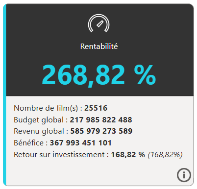

# Requetes SQL – Projet TMDb Power BI

Ce fichier ne répertorie que quelques requêtes qui ont été effectuées pour récupérer des données déjà transformées (via la requête SQL) et prêtes à l'emploi, pour analyse. Certaine requêtes ont également été effectué pour des debug ou des vérifications de résultat (voir si le résultat de visuels / mesures concordaient dans Power BI et SQL).

---

## Récupération des réalisateurs les plus populaires. 

```SQL
SELECT nom, realisateur_id, moyenne_note 
FROM realisateurs AS r
JOIN (
	SELECT realisateur_id, AVG(note_moyenne) AS moyenne_note
	FROM films AS f
	JOIN films_realisateurs AS fr ON f.id = fr.film_id 
	GROUP BY realisateur_id
	HAVING COUNT(*) > 12) AS f
ON f.realisateur_id = r.id 
ORDER BY moyenne_note DESC
LIMIT 30;
```

Explication : Dans l'onglet de rentabilité, un filtre pertinent à mettre serait sur les réalisateurs, on pourrait alors avoir la rentabilité du réalisateur et d'autres indicateurs. Toutefois, comme il y a 12 000 réalisateurs dans la base de données, il est préférable de créer un filtre sur les meilleurs réalisateurs. C'est d'ailleurs plus simple de le faire avec une requête SQL que Power Query ou DAX. Ici, deux conditions : 
- Le réalisateur doit être actif (avoir fait plus de 12 films). *NB : 12 n'est pas un chiffre au hasard, la base de données possède 13 films de Quentin Tarantino, et il a le mérite d'être inclus*. 
- On prend les 30 réalisateurs qui ont en moyenne ont les meilleures notes sur leur films


## Vérification & Debug

Pendant la phase de modélisation et d’analyse, les résultats obtenus dans Power BI ont été régulièrement vérifiés à l’aide de requêtes SQL exécutées directement sur la base PostgreSQL. Cette double vérification a permis de s'assurer de la cohérence des données, de valider la logique des mesures DAX et de garantir la fiabilité des visualisations.

### Vérification de la carte rentabilité

```SQL
SELECT (SUM(revenu) - SUM(budget)) AS test
FROM films_genres AS fg
JOIN films AS f
ON f.id = fg.film_id 
WHERE fg.genre_id = 10770 AND budget > 0 AND revenu > 0
```

Pour rappel, la carte rentabilité ressemble à ça : 



```SQL
SELECT SUM(budget) AS test
FROM films_genres AS fg
JOIN films AS f
ON f.id = fg.film_id 
WHERE fg.genre_id = 37 AND budget > 0 AND revenu > 0

UNION ALL 

SELECT SUM(revenu) AS test
FROM films_genres AS fg
JOIN films AS f
ON f.id = fg.film_id 
WHERE fg.genre_id = 37 AND budget > 0 AND revenu > 0
```

Explication : Cette requête, par exemple, permet d'avoir le budget et le revenu du genre Western, que je compare ensuite aux résultats dans Power BI 

Ainsi, dans Power BI, on a : 


*NB : résultat avec un filtre sur le genre western appliqué*.

Et dans SQL : 


### Vérification rentabilité Western

```SQL
SELECT SUM(revenu) / SUM(budget) AS test
FROM films_genres AS fg
JOIN films AS f
ON f.id = fg.film_id 
WHERE fg.genre_id = 37 AND budget > 0 AND revenu > 0
```

Explication : Même chose pour la rentabilité en % comme je n'étais pas sûr du résultat dans Power BI 

Dans Power BI : 


Et dans SQL : 


## Récupération des acteurs les plus populaires

### Conditions strictes 

```SQL
SELECT 
	id, nom,
	CASE WHEN sexe = 2 THEN 'Homme' ELSE 'Femme' END AS sexe, 
	ROUND(avg::numeric, 2) AS popularite
FROM acteurs AS a
JOIN (
SELECT acteur_id, AVG(popularite) -- ne change rien car la popu est la même pour tte les lignes d'un acteurs ** 
FROM films_acteurs 
GROUP BY acteur_id
HAVING COUNT(*) > 30) AS b
ON b.acteur_id = a.id
ORDER BY avg DESC 
LIMIT 100; 
```

Explication : Dans l'onglet acteurs, il est possible de filtrer les visuels selon une poignée d'acteur très populaire (100). Toutefois, comme il y a presque 30 000 acteurs dans la base de données, il est préférable de créer un filtre sur les meilleurs acteurs. C'est l'objectif de cette requête SQL, créer une table des 100 meilleurs acteurs, à importer dans Power BI. Il y a ici deux conditions : 
- L'acteur doit être actif, avoir fait plus de 30 films
- L'acteur doit être populaire, on séléctionne les 100 plus populaires


Cependant, ce segment ne doit pas être le filtre sur notre onglet, car 100 acteurs ne représentent qu'une faible proportion des insights disponibles, d'où la création d'une seconde table (ci-dessous) avec des conditions beaucoup plus souples. 

### Conditions souples

```SQL
SELECT 
	id, nom,
	CASE WHEN sexe = 2 THEN 'Homme' ELSE 'Femme' END AS sexe, 
	popularite
FROM acteurs AS a
JOIN (
SELECT acteur_id, ROUND(AVG(popularite)::numeric, 2) AS popularite
FROM films_acteurs 
GROUP BY acteur_id
HAVING COUNT(*) > 0) AS b
ON b.acteur_id = a.id
WHERE popularite > 1; 
```


